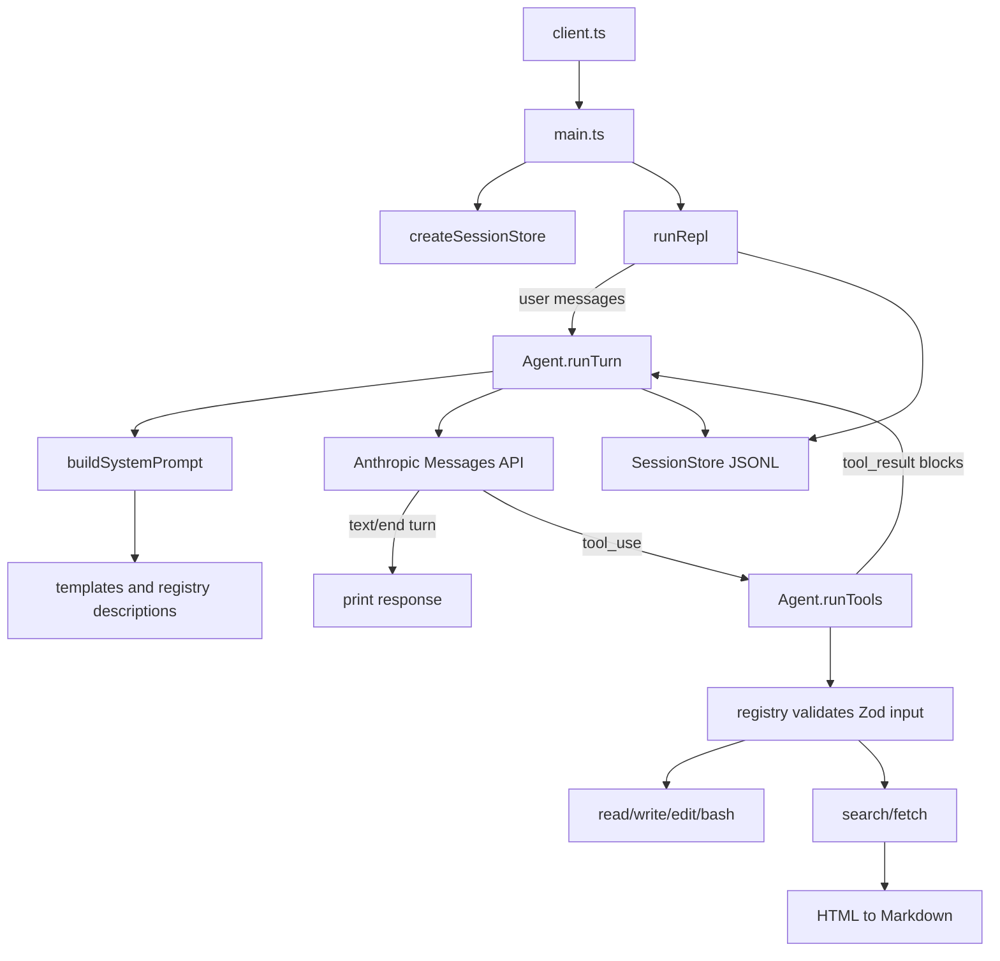

# Redwake coding agent: source walkthrough

## Purpose and boundaries

Redwake is a small interactive coding agent. Bun starts a TypeScript CLI, the CLI collects a growing conversation, and `Agent` sends that conversation plus a generated system prompt and tool definitions to Anthropic. When the model requests tools, Redwake executes them locally or over HTTP, adds their results to the conversation, and asks the model again. A turn ends only when the model returns a response whose `stop_reason` is not `tool_use`.

The runtime implementation is under `source/`. This document covers every file there, including prompt/template, declaration, test-helper, and historical-design files. The Bun test suites in `tests/` are described separately as executable specifications rather than runtime components.

## Startup and interactive shell

### `source/client.ts`

This is the executable entrypoint (`package.json` points its `module` field and `start` script at it).

1. The Bun shebang permits direct execution where the file is executable.
2. It imports `main` from `main.ts`.
3. It changes the process title to `redwake`, making process listings identifiable.
4. Top-level `await main()` transfers control to the application and lets rejections fail the process naturally.

### `source/main.ts`

`main.ts` translates standard input into conversation turns and establishes session persistence.

- `ReplIO` is the small I/O abstraction: `question(prompt)` either resolves to text or `null` at EOF, and `close()` releases the resource. Its narrow shape allows the REPL to be unit-tested with a fake terminal.
- `runRepl(agent, io, store?)` owns the in-memory `messages` array for one interactive process. On each iteration it prompts with `> `. A falsy answer—an empty line or `null`—returns before calling the model. Otherwise it creates a user `MessageParam`, appends it to both the array and optional session store, then calls `agent.runTurn(messages)`. The `finally` always closes the I/O interface, including when a model/tool call throws.
- `main(argv = process.argv.slice(2))` treats its first positional argument as a working directory and calls `chdir` when supplied. It creates a session store for that resulting directory, prints its file path, builds Node's promise-based readline interface, adapts readline errors to EOF (`null`), and calls `runRepl` with a real `Agent` and the shared store.

`runRepl` records only the user message itself. The `Agent` receives the same store and records assistant messages and tool-result messages, which produces one ordered persisted transcript.

## Shared configuration and prompt assembly

### `source/config.ts`

This is the runtime-constant module. It centralizes:

- `MODEL = "claude-opus-5"` and `MAX_TOKENS = 4096` for every Anthropic request;
- `SESSIONS_ROOT`, computed as `~/redwake/agent/sessions` from the OS home directory;
- output and HTTP limits: 20,000 characters and 1,000 lines for file reads, a 20,000-character window for fetched pages, a 20-second HTTP timeout, and 20 raw search results requested from Brave.

Other modules consume these constants instead of duplicating policy.

### `source/system_prompt.md`

The base system-prompt template says the model is Redwake Agent and contains three substitution tokens:

- `{custom_system.md}` for the local extension text;
- `{current_date}` for the UTC ISO calendar date;
- `{cwd}` for the process working directory.

### `source/custom_system.md`

This is the current user-editable prompt extension. Its one instruction is to include the current date in the final response. It is injected verbatim by the prompt builder.

### `source/agent/system-prompt.ts`

`buildSystemPrompt()` makes the final model system string at request time.

1. `sourceDir` is calculated relative to `import.meta.url`, so loading the prompt files does not depend on the process CWD (which `main` may change to the target project).
2. It synchronously reads the base template and custom extension.
3. It imports the central `tools` registry and formats every tool as `- name: description`.
4. It replaces all three base-template placeholders, using the current date and `process.cwd()` at call time, and appends an `Available tools:` list.

The prompt explains the environment in prose while the API receives the actual tool input schemas separately.

## Agent protocol

### `source/agent/loop.ts`

This is the Anthropic tool-use loop.

- `Conversation` is the REPL-facing contract: an implementation runs one conversation turn against a mutable `MessageParam[]` and returns the terminal Anthropic `Message`. Tests can therefore supply a trivial fake conversation.
- `AgentOptions` supports dependency injection for the Anthropic client, tool context, output function, and session store. Production defaults are a new Anthropic client, `createToolContext()`, `console.log`, and no persistence unless a store is supplied.
- `textFromMessage(message)` filters the structured content blocks down to `text` blocks and joins their text with newlines. Tool-use blocks are intentionally not printed as human output.

`Agent` constructs the production implementation:

1. The constructor captures dependencies and eagerly creates `anthropicTools` by converting the local tool registry once. Schema conversion is stable for the agent lifetime.
2. `createMessage(messages, system?)` sends the complete accumulated transcript, configured model, token limit, resolved system prompt (or an explicit override), and the generated Anthropic tool definitions to `client.messages.create`.
3. `runTools(message)` scans the assistant content in order. For each `tool_use` block, it calls the registry dispatcher with the block name, model-provided input, and shared tool context. A success becomes a non-error `tool_result` whose content is JSON-serialized output. Each failure is caught independently and becomes an error `tool_result` containing `{ "error": detail }`; one broken tool call therefore does not prevent later requested tool calls from executing.
4. `runTurn(messages)` is a `while (true)` continuation loop. It sends the conversation, appends and persists the assistant response, and prints any text. If the model did not stop for `tool_use`, that response is terminal and is returned. Otherwise it runs the requested tools, packages all their results as the content of a synthetic `user` message (the Anthropic protocol's tool-result role), appends/persists it, and repeats with the augmented history.

The mutable message array is the key protocol state. Its normal shape for a tool-using turn is user request → assistant tool-use response → user tool-result blocks → assistant follow-up, with further pairs as needed.

## Durable session history

### `source/session/store.ts`

This module implements best-effort append-only JSONL session logs.

- `SessionMessage` is the on-disk record shape: monotonically assigned numeric `id`, a nullable `parent` ID, message role, and original message content. Content can be plain text or Anthropic's structured blocks, so tool calls/results remain representable.
- `SessionStore` holds `nextId` and `lastId` only for the current writer. `append(message)` builds a record linking `parent` to the prior successful write, synchronously appends one JSON object and newline, then advances both counters. Disk errors are caught and reported to stderr; the conversation continues, and counters do not advance after a failed append. The comment notes that the parent format can represent forks even though this writer emits a linear chain.
- `createSessionStore(cwd = process.cwd(), root = SESSIONS_ROOT)` resolves the CWD, URI-encodes that absolute path into a per-project directory, creates it, scans existing names matching `session-<number>.jsonl`, and returns a store for one greater than the highest number. It does not create the JSONL file until the first append.

## Tool framework

### `source/tools/context.ts`

Tools share a mutable, dependency-injectable `ToolContext`.

- `readPaths` is a set of resolved absolute paths read or written during this agent process. It enforces the safety rule that an existing file must be read before it is overwritten.
- `fetch` and `env` are injectable functions, defaulting to global `fetch` and `process.env`. This keeps network and credential-dependent behavior deterministic in tests.
- `createToolContext(overrides)` builds those defaults while preserving supplied test doubles or a supplied read-path set.
- `ToolError` identifies expected operational/validation errors. The agent loop turns its message into a model-visible failed tool result.
- `Tool<S>` colocates name, description, Zod schema, and a handler whose input is inferred from that schema. `AnyTool` erases the generic solely so heterogeneously shaped tools can live in one registry; it deliberately accepts `never` until the dispatcher validates raw input. `defineTool` preserves generic inference at each declaration.

### `source/tools/registry.ts`

This is the single authoritative catalog of the six available tools: `read`, `write`, `edit`, `bash`, `search`, and `fetch`.

- The ordered `tools` array controls how tools are listed to the model and in the generated system prompt.
- `toolsByName` provides constant-time lookup for execution.
- `toAnthropicTools()` converts each Zod schema to JSON Schema with references disabled, removes the JSON Schema meta-field, and emits Anthropic's `{ name, description, input_schema }` shape. Thus the runtime validator and advertised API schema are derived from the same source.
- `runTool(name, rawInput, ctx)` rejects unknown names as `ToolError`, parses the raw model input through the corresponding Zod schema, and invokes the typed handler. The small cast restores the erased handler signature after validation.

## Local filesystem and shell tools

### `source/tools/read.ts`

The `read` tool accepts `file_path` and an optional inclusive, one-based `view_range` of exactly two integers. Zod requires the start to be at least one and the end either `-1` (EOF) or no earlier than the start.

Its handler resolves the path relative to the current process directory, stats it, rejects directories, and reads bytes. It rejects binary data both when a NUL byte occurs and when strict UTF-8 decoding fails. `splitLines` mirrors Python's `str.splitlines` behavior for a trailing terminator, avoiding a fabricated final empty line. The selected lines are rendered as `N: text`, bounded by the configured line and character ceilings; a truncation marker tells the model to request a narrower range. After a successful read/decoding path, the resolved path is added to `ctx.readPaths` so that it may subsequently be overwritten.

### `source/tools/write.ts`

`writeText(filePath, contents, ctx)` is the shared write primitive for both writing and editing.

1. It resolves the path and stats it.
2. It rejects directories.
3. If an existing path is absent from `ctx.readPaths`, it refuses the overwrite. New paths are allowed without a preceding read.
4. It recursively creates parent directories, writes UTF-8 contents, records the resolved path as read/written, and returns a success string.

The exported `writeTool` supplies the `file_path`/`contents` schema and delegates directly to this primitive. Centralizing the guard prevents `edit` from bypassing it.

### `source/tools/edit.ts`

The `edit` tool does one safe exact replacement in a previously read file. Its schema requires `file_path`, `old_string`, and `new_string`.

The tool strips `N: ` prefixes from both strings so content copied from `read` output can be pasted back. It rejects an empty old text, reads the resolved file, counts exact occurrences, and rejects zero or multiple matches. One match is replaced with a replacement callback so `$1`, `$&`, and similar sequences remain literal text instead of JavaScript replacement syntax. It then calls `writeText`; this both writes the result and enforces the read-before-overwrite invariant.

### `source/tools/bash.ts`

The `bash` tool accepts a single command string and runs `/bin/sh -c <command>` through Bun's shell API. The interpolation sends the full command as one argument to `sh`, matching Python's shell-enabled subprocess semantics without Bun reparsing its contents. `.quiet().nothrow()` captures normal output and suppresses automatic failure throwing. The returned object always contains string `stdout`, string `stderr`, and numeric `exit_code`, including for nonzero commands. It intentionally exposes local shell execution to the model.

## Web tools and conversion pipeline

### `source/tools/search.ts`

`search` wraps Brave's web-search endpoint.

- Input consists of a nonblank query plus optional `domains` and optional positive integer `recency_days`.
- `normalizeDomains` trims, lowercases, removes trailing dots, validates hostnames with a conservative hostname pattern, and returns either a deduplicated set or `null` (unrestricted). `matchesDomains` parses a result URL and allows an exact requested hostname or a subdomain, so `good.com` includes `sub.good.com` but not `notgood.com`.
- `freshnessRange` turns a requested number of days into Brave's `YYYY-MM-DDtoYYYY-MM-DD` range, ending on the current UTC date.
- The handler obtains `BRAVE_SEARCH_API_KEY` through the context, failing clearly if missing. It sends `q`, configured result count, optional freshness, required JSON `Accept`, Brave's subscription header, and an abort signal using the configured timeout.
- Transport failures and non-OK responses collapse to a stable `ToolError`; invalid JSON and malformed result envelopes receive distinct errors. For each usable result, it filters domains, extracts title/description safely, chooses `page_age` or falls back to `article.date`, assigns ranks after filtering, and returns at most ten normalized results.

Search supplies candidate URLs; it does not retrieve page bodies itself.

### `source/tools/fetch.ts`

`fetch` accepts an absolute HTTP(S) URL and a nonnegative `offset` defaulting to zero. The handler uses the injectable fetch function with the common timeout; transport or non-OK failures become `ToolError`s that include the requested URL. For a successful response, it uses its final URL after redirects where available, reads the response body as HTML, and calls `htmlToMarkdown`.

It returns a character window, not a whole unbounded article: `content_markdown` is `markdown.slice(offset, offset + FETCH_WINDOW_CHARS)`, `truncated` tells whether more remains, and `total_length` allows callers to page deterministically. The page title is returned alongside the content.

### `source/tools/html-to-markdown.ts`

This helper turns arbitrary fetched HTML into reader-oriented Markdown.

1. Cheerio parses the document. The title is the first `<title>` normalized for whitespace, falling back to the final page URL.
2. It chooses the first `main`, otherwise first `article`, `body`, or `html`, preferring semantically focused content.
3. It removes common chrome/non-content selectors: asides, footers, forms, headers, navigation, `noscript`, scripts, styles, and templates.
4. It walks links and resolves parseable relative `href` values against the page URL. Invalid URLs are intentionally retained unchanged.
5. Before general conversion, it removes each `<pre>` block and substitutes a unique marker. For each block it extracts plain code, looks for a `language-*` class on contained code, calculates a backtick fence longer than every backtick run inside the code (at least three), and stores a literal fenced Markdown block. This avoids Turndown corrupting code and keeps valid fences even when code itself includes backticks.
6. Turndown converts the remaining selected HTML using ATX headings, fenced code blocks, and the GitHub-flavored Markdown plugin. The stored code-block strings replace their markers in the output.

`fetch` is therefore the composition of HTTP retrieval, document focus, semantic Markdown conversion, and bounded pagination.

## Non-runtime source files

### `source/types/turndown-plugin-gfm.d.ts`

The third-party GFM plugin lacks sufficient bundled TypeScript declarations for this project. This ambient module declaration tells TypeScript that the module exports `gfm`, `tables`, `strikethrough`, and `taskListItems`, each a `TurndownService.Plugin`. Runtime behavior still comes from the installed package; this file is compile-time type information only.

### `source/test/test.ts`

This minimal test utility exports `getDateTime()` and `getDateTimeString()`. Each obtains a fresh `Date`; the latter serializes it using `toISOString()`. It is independent of the agent runtime and provides simple date helpers for tests or experimentation.

### `source/testing.py`

This standalone Python utility is not imported by the Bun agent. `primes_up_to(limit = 1000)` implements the Sieve of Eratosthenes: it returns early below two, initializes a boolean candidate array, marks zero and one non-prime, then for each still-prime number through the square root marks its multiples starting at its square. A final enumeration returns prime indexes in ascending order. When run as a script it computes primes through 1,000 and prints the count and list. Its comments correctly state the usual $O(n \log\log n)$ sieve complexity.

### `source/memory_sessions_plan.md`

This is the design note that explains the persisted-session layout: a home-directory sessions root, a subdirectory per initialized application directory, numbered JSONL files, and one message object per line with `role`, `message`, `parent`, and `id`. `config.ts` and `session/store.ts` implement that plan. The note permits a history tree; the current store creates the linear case.

## Tests as executable behavior documentation

The `tests/` directory is outside `source/`, but it verifies the important contracts described above.

- `loop.test.ts` fakes Anthropic responses and checks registry schema generation, complete request parameters, prompt substitution, text extraction, terminal completion, tool-use continuation, independently serialized tool errors, and REPL behavior for blank lines/EOF.
- `session.test.ts` uses temporary directories to verify JSONL record content, parent linkage, structured block preservation, per-CWD session directories, numbered session allocation, and the persisted user/assistant/tool-result ordering through the REPL boundary.
- `tools.simple.test.ts` exercises line rendering/ranges/truncation and binary-directory rejection for `read`; directory creation and unread-overwrite denial for `write`; uniqueness and literal replacement behavior for `edit`; and stream/exit-code capture for `bash`.
- `tools.network.test.ts` injects fake fetch implementations to verify fetch's chrome removal, relative-link resolution, code-fence preservation, contiguous pagination, and error wrapping. It also verifies search filtering/ranking/date fallback, request construction, required credentials, backend errors, and invalid-domain rejection.

## How the pieces fit together

At launch, `client.ts` calls `main.ts`; `main` optionally changes into the requested target project, creates a per-project session file, and starts the readline REPL. Each nonempty user line becomes the next conversation message and is saved. The `Agent` resolves the prompt template and the six registry-provided JSON schemas, calls Anthropic, persists and prints any textual assistant output, and interprets `stop_reason`.

For a normal answer, the turn terminates after that first model response. For a tool-use answer, the agent dispatches every requested tool through the registry. Zod guards the model input before a handler runs; `ToolContext` shares process-local safety state, HTTP access, and environment lookup across all calls. Filesystem tools enforce the read-before-existing-overwrite rule, shell commands return captured process results, search provides normalized Brave URLs, and fetch transforms a selected remote document to page-sized Markdown. Every success or failure is returned to the model as a structured tool result, persisted, and used in the next API call. The loop then continues until the model produces a non-tool terminal response.

The resulting design has one source of truth for tool names, descriptions, schemas, and handlers; one mutable conversation transcript for the API protocol; and an append-only durable transcript that does not make an interactive session fail when storage is unavailable.
